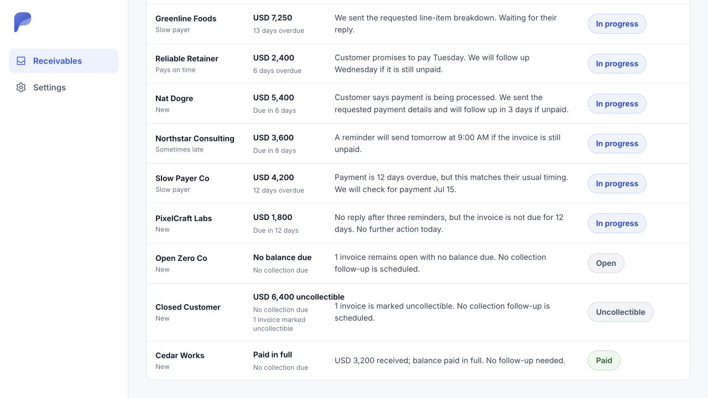
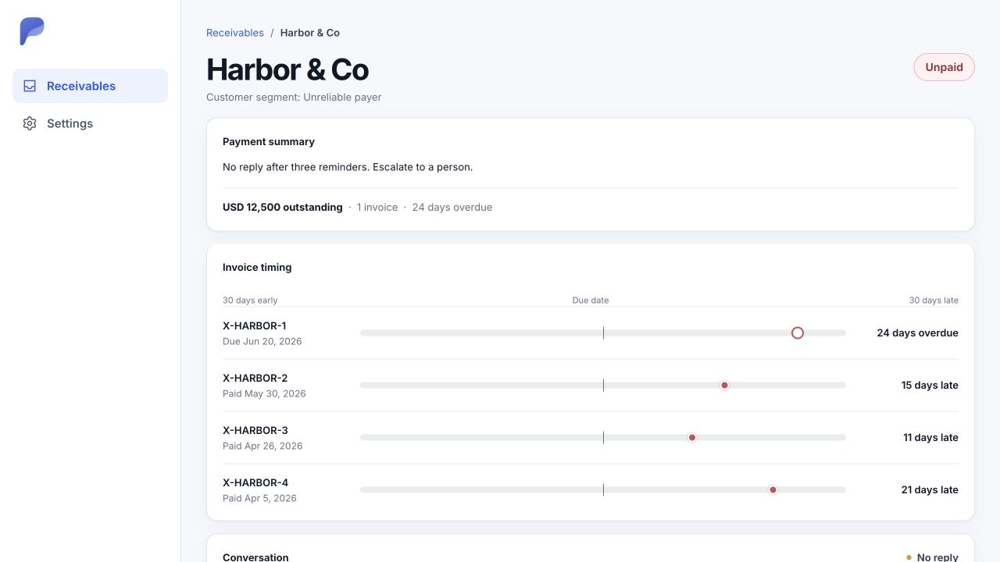
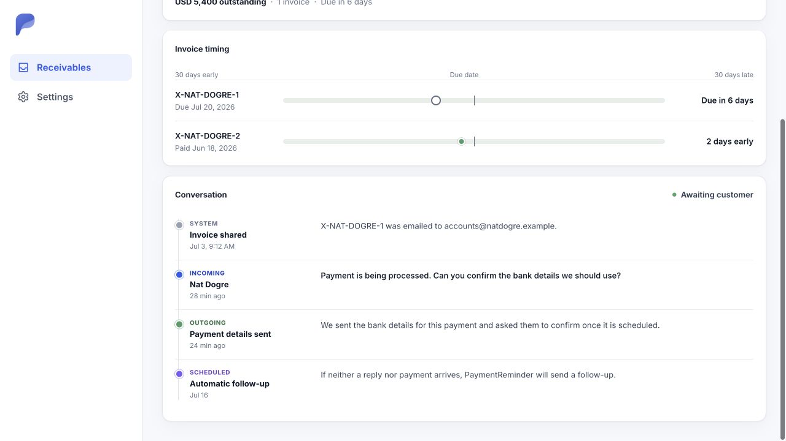
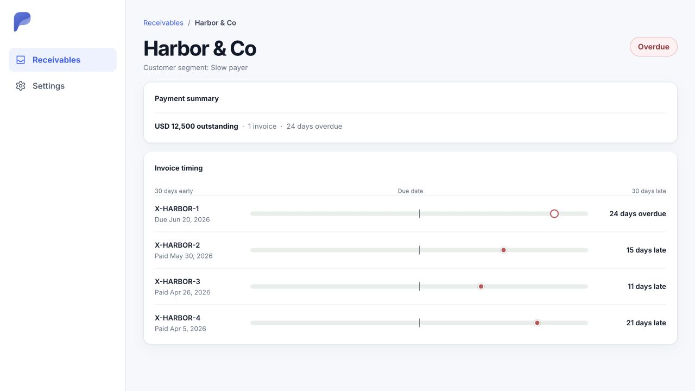

# Receivables UI north star

Captured on July 14, 2026 with disposable test-only customer and invoice data.

The receivables inbox is the only current authenticated receivables screen. Its
`after-home-` screenshots are the active product baseline: every displayed
value comes from persisted customers and invoices.

Until communication is persisted, the inbox should show only:

- customer identity;
- outstanding, overdue, open, paid, and uncollectible invoice facts;
- payer segments persisted after a full invoice sync and calculated from the
  latest 12 paid or uncollectible outcomes. Paid outcomes require both due and
  payment dates; any uncollectible outcome in the window is unreliable.

Customer inbox status is operational rather than a restatement of invoice
status. It currently follows this precedence: an overdue invoice needs
attention, an uncollectible invoice is unpaid, a current open invoice is in
progress, and a customer with issued invoices but no open or uncollectible
invoices is paid. Overdue and other invoice facts remain visible in the
Receivables column. Every six hours, a recurring job queues a full refresh for
each connected invoice source. Each successful provider sync first persists the
latest invoices and then recalculates every customer status in any direction
from those invoice facts.

Do not add reminder, reply, schedule, dispute, or conversation claims to the
inbox until the corresponding records and workflow exist.

## Inbox before cleanup

## Current persisted-facts baseline

## Archived customer-detail reference

There is currently no customer-detail route or screen. These captures are kept
only as visual reference for a future customer-detail feature. The conversation
examples are prototypes and must not return until their data and workflow are
persisted.

